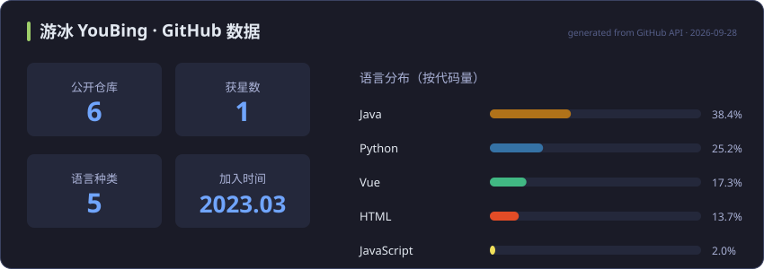

<h1 align="center">你好，我是 游冰 YouBing 👋</h1>

  
  

🎯 **Java 后端开发工程师**，在 toB 业务系统一线打磨工程能力，快速成长中

- 🤖 业余时间投入 **AI Agent 全栈项目**：LangGraph 编排、RAG 检索增强、Tool Calling、多模态应用
- 🧪 在个人项目中实践 Redis 高并发场景：缓存穿透 / 击穿 / 雪崩、秒杀、分布式锁
- 📝 在[个人博客](https://youbing-dev.github.io)记录后端学习笔记与踩坑复盘
- 🌱 相信 Vibe Coding —— 把想法更快地变成能跑起来的产品

## 🛠️ 技术栈

**后端**

**AI / Agent**

**前端 & 工具**

## 📌 精选项目

### 🌶️ [墨西 AI · 小红书智能内容创作平台](https://github.com/youbing-dev/xhs-copliot)

> Java + Python 混合架构的 AI Agent 全栈项目，持续打磨中 🔨

- 🧠 LangGraph **Plan-Execute-Reflect** 循环：LLM 动态规划任务 → 执行 → 质量评估自动重规划
- 🔧 6 个 Agent Tools：标题生成 / 正文创作 / 标签推荐 / 去 AI 味改写 / 趋势检索 / 敏感词校验
- 🔍 **RAG** 爆款笔记知识库（DashScope Embedding + Chroma），双层 Memory（Redis 短期对话 + Chroma 长期偏好）
- ⚡ SSE 流式推送思考与生成过程，执行链路追踪 + Token 成本统计，Python / Java 双链路容灾

`Java 17` · `Spring Boot 3` · `MyBatis-Plus` · `Python 3.11` · `LangGraph` · `Chroma` · `Vue 3` · `Redis`

### 🍳 [智能做菜推荐 AI 助手](https://github.com/youbing-dev/AI-)

FastAPI + LangChain 多模态做菜推荐 MVP：文本 / 图片 / 图文混合输入，本地菜谱召回 + 大模型动态生成，联网检索增强，无模型时自动本地降级。

### 🏪 [黑马点评](https://github.com/youbing-dev/hmdp)（Redis 实战）

短信登录、缓存穿透 / 击穿 / 雪崩应对、优惠券秒杀、分布式锁、好友 Feed 流；配套 Vue 3 前端 [dp_front](https://github.com/youbing-dev/dp_front)。

### ✍️ [个人博客](https://youbing-dev.github.io)

Hexo + Butterfly 搭建，记录 Java 后端与分布式系统的学习笔记和踩坑复盘。

## 📊 GitHub 数据

  

  

---

💬 想交流后端技术或 AI Agent 应用？欢迎通过[博客](https://youbing-dev.github.io)联系我
